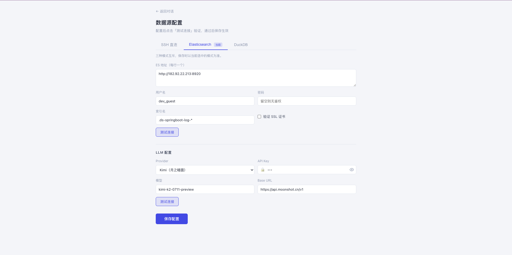

# LogMind — AI 日志分析平台

> 只需要 SSH 权限，5分钟内用自然语言查所有服务器的日志。

[](LICENSE)
[](https://python.org)
[](https://github.com/PanShiLon/logmind)

## 截图预览

| 首页 | 对话 |
|:---:|:---:|
|  |  |

| 图表分析 | 数据源配置 |
|:---:|:---:|
|  |  |

---

## 特性

- **SSH 直连模式** ⭐：只需服务器账号密码，零基础设施依赖，5分钟上手
- **Native 模式**：内置 DuckDB 存储 + 日志采集器，替代 ELK 全套（Phase 3）
- **Bridge 模式**：已有 Elasticsearch 直接接入，AI 替你写 DSL
- **Multi-Agent 架构**：LangGraph 驱动，自动识别意图 → 查询 Agent / 分析 Agent 分工
- **流式对话**：SSE 实时输出，工具调用过程可见，不是黑盒
- **多 LLM 支持**：Kimi / DeepSeek / Qwen / OpenAI，改一行配置切换
- **三模式共用一套 AI**：只改一行 `datasource.type`，Agent 逻辑不变

---

## 快速开始

### 方式一：本地运行

**1. 克隆并配置**

```bash
git clone https://github.com/PanShiLon/logmind.git
cd logmind/backend
cp config.example.yaml config.yaml
# 编辑 config.yaml，填入 SSH 服务器信息和 LLM API Key
```

**2. 安装后端依赖**（macOS，需要 Python 3.12）

```bash
brew install python@3.12 expat
/opt/homebrew/opt/python@3.12/bin/python3.12 -m venv .venv --without-pip
curl -sS https://bootstrap.pypa.io/get-pip.py | DYLD_LIBRARY_PATH=/opt/homebrew/opt/expat/lib .venv/bin/python
source .venv/bin/activate
DYLD_LIBRARY_PATH=/opt/homebrew/opt/expat/lib pip install -r requirements.txt
```

> Linux / Windows 无需 `DYLD_LIBRARY_PATH`，直接 `python -m venv .venv && pip install -r requirements.txt`。

**3. 启动后端**

```bash
./start.sh          # macOS
# 或：uvicorn main:app --reload --port 8000
```

**4. 启动前端**

```bash
cd ../frontend
npm install
npm run dev
```

访问 `http://localhost:5173` 开始对话。

---

## 配置示例

```yaml
llm:
  provider: kimi          # openai | kimi | deepseek | qwen | zhipu
  api_key: sk-xxxx
  model: kimi-k2-0711-preview
  base_url: https://api.moonshot.cn/v1

datasource:
  type: ssh               # 改为 duckdb 或 elasticsearch 即可切换模式

servers:
  - name: 支付服务
    host: 192.168.1.10
    username: deploy
    password: xxxx
    log_paths:
      - /var/log/payment/app.log
      - /var/log/payment/error.log
  - name: 订单服务
    host: 192.168.1.11
    username: deploy
    password: xxxx
    log_paths:
      - /var/log/order/*.log
```

可以直接问：

- `"支付服务今天有没有报错？"`
- `"过去1小时 NullPointerException 出现了多少次？"`
- `"分析一下最近的错误趋势，是否在加剧？"`
- `"所有服务里 ERROR 最多的是哪个？"`

---

## 支持的数据源

| 类型 | `datasource.type` | 说明 | 前置条件 |
|------|-------------------|------|---------|
| SSH 直连 ⭐ | `ssh` | 零基础设施，推荐起步 | SSH 账号密码 |
| 本地存储 | `duckdb` | 内置采集器，支持历史查询（Phase 3） | 无 |
| Elasticsearch | `elasticsearch` | 已有 ELK 直接接入 | ES 地址 |

三种模式无缝升级：SSH → DuckDB → ES，**不换工具，只改一行配置**。

---

## 支持的 LLM

| 提供商 | `provider` | 获取 Key |
|--------|-----------|---------|
| 月之暗面 Kimi | `kimi` | platform.moonshot.cn |
| DeepSeek | `deepseek` | platform.deepseek.com |
| 通义千问 | `qwen` | dashscope.aliyuncs.com |
| OpenAI | `openai` | platform.openai.com |
| 智谱 GLM | `zhipu` | open.bigmodel.cn |

---

## 项目结构

```
logmind/
├── backend/
│   ├── app/
│   │   ├── agents/          # LangGraph 状态图（classify → query/analysis）
│   │   ├── api/             # FastAPI 接口（SSE 流式输出）
│   │   ├── core/
│   │   │   ├── datasource/  # DataSource 抽象层（SSH/DuckDB/ES）
│   │   │   ├── llm_factory.py
│   │   │   └── settings.py
│   │   └── tools/           # LangChain Tools
│   ├── config.example.yaml
│   ├── main.py
│   └── start.sh
├── frontend/                # Vue3 + Element Plus
│   └── src/
│       ├── views/ChatView.vue
│       └── components/LogTable.vue
└── docs/
```

---

## 开发路线图

- [x] Phase 1：SSH 直连 + LangGraph + FastAPI 骨架
- [x] Phase 2：Analysis Agent + Vue3 前端 + 历史会话
- [x] Phase 3：Dashboard Agent + 图表渲染 + 数据源配置页
- [ ] Phase 4：Docker Compose + LangFuse 可观测性
- [ ] Phase 5：Electron 桌面应用（Windows + Mac）
- [ ] Phase 6：IntelliJ IDEA 插件

---

## Contributing

欢迎贡献！提交 PR 前请阅读 [CONTRIBUTING.md](CONTRIBUTING.md)。

## 声明

LogMind 是独立原创开发的项目，非任何现有项目的 fork 或衍生版本。
所有代码均为原创，依赖库协议详见 [NOTICE](NOTICE)。

## License

MIT © [panshilong](https://github.com/PanShiLon)
