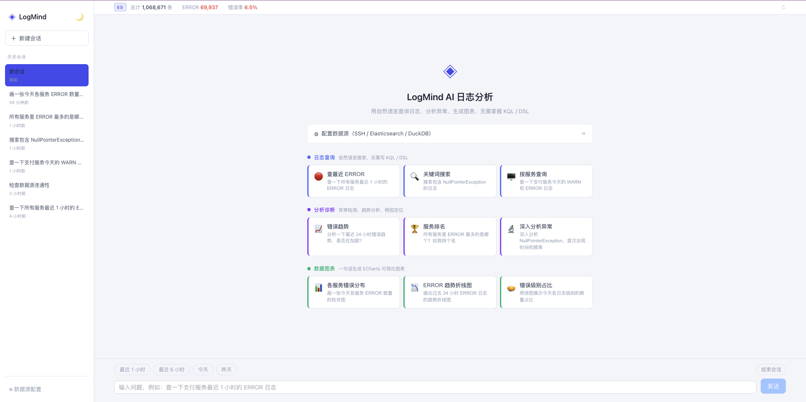
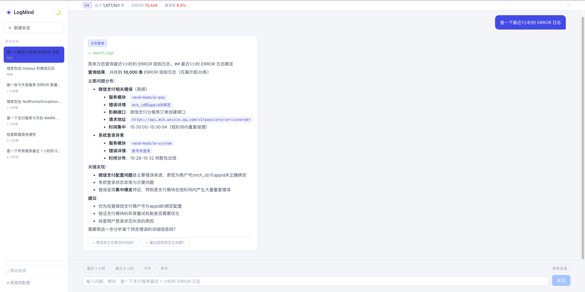
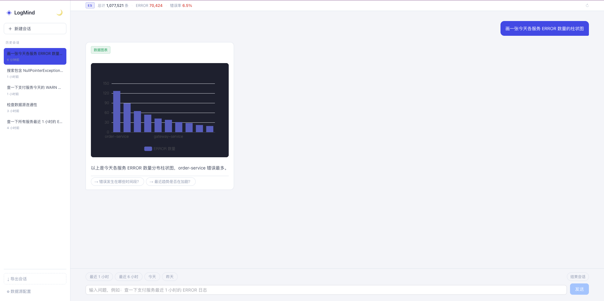

# LogMind — AI 日志分析平台

> 一套后台，两种用法：**清爽实时地直查日志**（零 LLM），或**用大白话让 AI 替你读日志、下结论、出图**。
> 数据源可插拔：SSH / Elasticsearch / DuckDB / Loki，改一行配置切换，AI 逻辑不变。

[](LICENSE)
[](https://python.org)
[](https://github.com/PanShiLon/logmind)

## 截图预览

| 首页 | 对话 |
|:---:|:---:|
|  |  |

| 图表分析 | 数据源配置 |
|:---:|:---:|
|  |  |

---

## 这个项目解决什么

日志散在多个系统 / 服务 / 环境里，出问题时要么不知道去哪查，要么查到了一堆原始行也读不懂。LogMind 把「看日志」拆成两条互补的路，你按需选：

1. **日志直查**（落地页，`/`）：一个清爽的日志浏览器——下拉筛级别 / 时间窗、关键词搜、实时刷新、点开看详情、导出 CSV。**不写查询语法、不调用任何大模型**，日志只在 你↔后端↔数据源 之间流动。适合「我就想快速翻日志、盯实时」。
2. **AI 分析**（`/chat`）：用自然语言问「最近 1 小时报错多少」「错误趋势是否在加剧」「哪个服务 ERROR 最多」，AI 自动查数据源 → 归纳结论 + 生成图表。**这条路会把查询到的日志内容发给 LLM**，敏感环境请评估后使用。

两条路读**同一个数据源**，随时切换。

---

## 核心原理（架构）

```
┌─────────────┐     ┌──────────────────────── Backend (FastAPI) ────────────────────────┐
│  Vue3 前端  │     │                                                                    │
│             │     │   /api/logs/more ──────────────► DataSource.search()   ← 直查，零 LLM │
│ ExplorerView│◄───►│                                        │                           │
│  (直查页)   │     │   /api/chat (SSE) ──► LangGraph 状态图  │                           │
│ ChatView    │     │        classify → query / analysis / dashboard agent               │
│  (AI 分析)  │     │              │              └──► LangChain Tools ──► DataSource      │
│ ConfigView  │     │              └──► LLM (Kimi/DeepSeek/…)                             │
└─────────────┘     └────────────────────────────────────┬───────────────────────────────┘
                                                          │  LogDataSource 抽象（ABC）
                              ┌───────────────┬───────────┼───────────┬──────────────┐
                            SSH            Elasticsearch  DuckDB      Loki
                        (grep 远程日志)   (接已有 ELK)  (本地存储)  (接 Grafana Loki)
```

关键设计：

- **DataSource 抽象**（`backend/app/core/datasource/base.py`）：所有数据源实现同一个 `LogDataSource` 接口（`search` / `aggregate` / `time_series` / `health_check`）。上层的 AI Agent 和直查接口都只依赖这个接口，**不感知底层是 SSH 还是 Loki**。加新数据源 = 实现一个类 + 工厂注册一行，其它代码不动。
- **直查与 AI 解耦**：`/api/logs/more` 直接调 `DataSource.search()` 返回 JSON，全程不实例化 LLM；`/api/chat` 才走 LangGraph + LLM。所以「不发数据给大模型」不是靠配置约束，而是**架构上就是两条独立路径**。
- **Multi-Agent**：LangGraph `StateGraph` 做 ReAct 循环，先 classify 意图，再路由到 query / analysis / dashboard agent，能根据工具结果决定是否继续调用。
- **流式输出**：SSE + `astream_events`，工具调用过程实时可见，不是黑盒。

---

## 快速开始

### 1. 克隆并配置

```bash
git clone https://github.com/PanShiLon/logmind.git
cd logmind/backend
cp config.example.yaml config.yaml
# 编辑 config.yaml：选一种数据源 + 填 LLM API Key（只用直查页可先不填 key）
```

### 2. 安装后端依赖（Python 3.12）

**macOS**（Homebrew Python 有 libexpat 兼容问题，需 `DYLD_LIBRARY_PATH`）：

```bash
brew install python@3.12 expat
/opt/homebrew/opt/python@3.12/bin/python3.12 -m venv .venv --without-pip
curl -sS https://bootstrap.pypa.io/get-pip.py | DYLD_LIBRARY_PATH=/opt/homebrew/opt/expat/lib .venv/bin/python
source .venv/bin/activate
DYLD_LIBRARY_PATH=/opt/homebrew/opt/expat/lib pip install -r requirements.txt
```

**Linux / Windows**（无需 `DYLD_LIBRARY_PATH`）：

```bash
python3.12 -m venv .venv && source .venv/bin/activate   # Windows: .venv\Scripts\activate
pip install -r requirements.txt
```

### 3. 启动后端

```bash
./start.sh          # macOS，已封装 DYLD_LIBRARY_PATH
# 或：uvicorn main:app --reload --port 8000
```

### 4. 启动前端

```bash
cd ../frontend
npm install
npm run dev
```

打开 `http://localhost:5173`：

- `/` —— 日志直查（落地页，零 LLM）
- `/chat` —— AI 分析
- `/config` —— 数据源与 LLM 配置（改完点「测试连接」再保存，热生效）

---

## 支持的数据源

| 类型 | `datasource.type` | 说明 | 前置条件 |
|------|-------------------|------|---------|
| SSH 直连 ⭐ | `ssh` | 零基础设施，SSH 远程 grep 日志文件，推荐起步 | SSH 账号密码 |
| Elasticsearch | `elasticsearch` | 接已有 ELK，全文检索 + 聚合 + 真分页 | ES 地址 |
| 本地存储 | `duckdb` | 内置采集器 + DuckDB，支持历史查询 | 无 |
| Loki | `loki` | 接已有 Grafana Loki，直查 + AI 皆可 | Loki HTTP 地址 |

**改一行 `datasource.type` 即可切换**，AI Agent / 直查页逻辑完全不变。

### 各数据源配置示例

```yaml
# ── SSH：远程 grep ──
datasource:
  type: ssh
servers:
  - name: 支付服务
    host: 192.168.1.10
    username: deploy
    password: xxxx            # 或 private_key_path: ~/.ssh/id_rsa
    log_paths:
      - /var/log/payment/*.log

# ── Elasticsearch：接 ELK ──
datasource:
  type: elasticsearch
  hosts: ["http://192.168.1.100:9200"]
  username: elastic
  password: xxxx
  default_index: "app-logs-*"
  verify_certs: false

# ── DuckDB：本地存储 ──
datasource:
  type: duckdb
  db_path: ./data/logmind.db

# ── Loki：接 Grafana Loki ──
datasource:
  type: loki
  loki_url: http://localhost:3100
  loki_selector: '{container_name=~".+"}'   # 标签选择器；只看某容器：'{container_name="my-app"}'
```

> 也可以全程用 `/config` 页面图形化配置（含「测试连接」），不用手改 YAML。

---

## 支持的 LLM（仅 AI 分析页需要）

| 提供商 | `provider` | 获取 Key |
|--------|-----------|---------|
| 月之暗面 Kimi | `kimi` | platform.moonshot.cn |
| DeepSeek | `deepseek` | platform.deepseek.com |
| 通义千问 | `qwen` | dashscope.aliyuncs.com |
| OpenAI | `openai` | platform.openai.com |
| 智谱 GLM | `zhipu` | open.bigmodel.cn |
| 自定义 | 任意（填 base_url） | 兼容 OpenAI 协议即可（如 Ollama） |

```yaml
llm:
  provider: kimi
  api_key: sk-xxxx
  model: kimi-k2-0711-preview
  base_url: https://api.moonshot.cn/v1
```

AI 分析页可以直接问：

- `"支付服务今天有没有报错？"`
- `"过去 1 小时 NullPointerException 出现了多少次？"`
- `"分析最近的错误趋势，是否在加剧？"`
- `"画一张各服务 ERROR 数量的柱状图"`

---

## 扩展：加一个新数据源

得益于 `LogDataSource` 抽象，接入新的日志后端很轻：

1. 在 `backend/app/core/datasource/` 新建 `xxx.py`，实现 `LogDataSource` 的四个方法（参考 `es.py` / `loki.py`，各约 150 行）：
   - `search(query, level, start_time, end_time, limit, offset)` → `SearchResult`
   - `aggregate(field, ...)` → `{值: 计数}`
   - `time_series(interval, ...)` → `[{timestamp, count}]`
   - `health_check()` → `{status, ...}`
2. 在 `backend/app/core/datasource/factory.py` 的 `match` 里加一个 `case "xxx":`。
3. 在 `backend/app/core/settings.py` 的 `DatasourceConfig` 里加该源需要的字段。
4. （可选）`backend/app/api/config.py` 加 `/test-connection/xxx` 接口 + `/config` 页面加一个 tab，就能图形化配置。

上层 Agent、直查页、前端组件**都不用改**——它们只认接口。

---

## 项目结构

```
logmind/
├── backend/
│   ├── app/
│   │   ├── agents/graph.py        # LangGraph 状态图（classify → query/analysis/dashboard）
│   │   ├── api/
│   │   │   ├── chat.py            # /api/chat（SSE 流式，走 LLM）+ /api/logs/more（直查，零 LLM）
│   │   │   ├── config.py          # 配置读写 + 各数据源测试连接
│   │   │   └── sessions.py        # 历史会话（SQLite）
│   │   ├── core/
│   │   │   ├── datasource/        # ★ DataSource 抽象层：base/ssh/es/duckdb/loki + factory
│   │   │   ├── llm_factory.py
│   │   │   └── settings.py        # config.yaml → Pydantic
│   │   └── tools/                 # LangChain Tools（AI 调用的查询工具）
│   ├── config.example.yaml
│   ├── main.py
│   └── start.sh
├── frontend/                      # Vue3 + Element Plus + ECharts
│   └── src/
│       ├── views/
│       │   ├── ExplorerView.vue   # 日志直查页（落地页，零 LLM）
│       │   ├── ChatView.vue       # AI 分析对话页
│       │   └── ConfigView.vue     # 数据源 / LLM 配置页
│       ├── components/LogExplorer.vue   # 日志浏览器组件（筛选/详情/CSV）
│       └── router/index.js
└── docs/
```

---

## 数据安全说明

- **直查页**（`/` 与 `/api/logs/more`）**不接触任何 LLM**，日志只在 你↔后端↔数据源 之间。想要「日志绝不出内网」，只用这个页面即可。
- **AI 分析页**（`/chat`）会把查询到的日志内容发给你配置的 LLM 提供商。生产 / 敏感环境请评估：可换成内网自建模型（`provider: custom` + 内网 `base_url`），或只在脱敏环境使用。
- API Key 存在后端 `config.yaml`（已 `.gitignore`），前端配置页回显时打码为 `***`。

---

## 开发路线图

- [x] Phase 1：SSH 直连 + LangGraph + FastAPI 骨架
- [x] Phase 2：Analysis Agent + Vue3 前端 + 历史会话
- [x] Phase 3：Dashboard Agent + 图表渲染 + 数据源配置页
- [x] Phase 3.5：LogExplorer 重构 + 分页 + AI 稳定性
- [x] Loki 数据源 + 日志直查页（零 LLM 浏览 + 实时刷新）
- [ ] Phase 4：主动监控预警（异常突增推送 / 每日报告 / 上线检测）
- [ ] Phase 5：Docker Compose + LangFuse 可观测性
- [ ] Phase 6：Electron 桌面应用 / IDEA 插件

---

## Contributing

欢迎贡献！提交 PR 前请阅读 [CONTRIBUTING.md](CONTRIBUTING.md)。

## 声明

LogMind 是独立原创开发的项目，非任何现有项目的 fork 或衍生版本。
所有代码均为原创，依赖库协议详见 [NOTICE](NOTICE)。

## License

MIT © [panshilong](https://github.com/PanShiLon)
